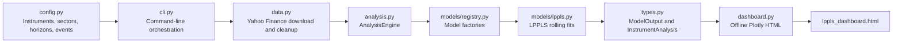

# LPPLS Bubble Research Dashboard

This project downloads complete weekly market-price histories, runs a
Log-Periodic Power Law Singularity (LPPLS) analysis across several rolling
windows, and writes the results to one self-contained interactive HTML file.
It is intended for research and exploration of persistent LPPLS-style signals;
it does not provide investment advice or a calibrated prediction of a market
peak or crash.

## What it includes

The generated dashboard has four views:

- **Market overview** compares cumulative returns for the S&P 500, NASDAQ
  Composite, and Dow Jones Industrial Average from a shared display baseline.
  It also shows the latest score for each index and their weekly-aligned mean.
- **Historical comparison** places market-index scores and S&P 500 sector scores
  alongside the configured Dot-com and housing/credit market contexts.
- **Individual stock** provides an interactive LPPLS view for each configured
  stock. Return, score, and qualified-estimate traces can be toggled from the
  legend above the chart.
- **Parameters / diagnostics** shows the latest fit parameters and filter
  outcomes for market indices and S&P 500 sectors. Individual stocks are kept
  in their dedicated chart view.

## Architecture



The command-line program coordinates the flow. Configuration defines the
universe to analyse, the data layer retrieves one weekly history per symbol,
the analysis engine passes each series through every registered model, and the
dashboard renderer converts the model-neutral results into a single HTML file.

## Project layout

```text
LPPLS/
├── lppls_test.py          Thin executable entry point
├── requirements.txt       Runtime and test dependencies
├── lppls_dashboard.html   Generated dashboard output
├── lppls/
│   ├── __init__.py        Public package exports
│   ├── cli.py             Argument parsing and application workflow
│   ├── config.py          Instruments, horizons, events, and output defaults
│   ├── data.py            Yahoo Finance provider and price normalization
│   ├── analysis.py        Model execution for each instrument
│   ├── types.py           Shared result dataclasses
│   ├── dashboard.py       Offline Plotly dashboard renderer
│   └── models/
│       ├── base.py        BubbleModel interface
│       ├── registry.py    Model factory registry
│       └── lppls.py       LPPLS model and qualification filters
└── tests/                 Network-free unit and dashboard tests
```

## Main modules

| Module | Responsibility |
| --- | --- |
| `lppls/config.py` | Defines market indices, S&P 500 sector indices, individual stocks, historical event windows, and rolling horizons. |
| `lppls/data.py` | Implements `YahooFinanceProvider`, downloads weekly auto-adjusted prices from the earliest available record, and normalizes the close series. |
| `lppls/analysis.py` | Uses `AnalysisEngine` to run every registered model for each instrument with available data. |
| `lppls/models/base.py` | Defines the `BubbleModel` contract: accept a positive chronological price series and return `ModelOutput`. |
| `lppls/models/lppls.py` | Performs deterministic grid-based LPPLS fits, applies qualification filters, and produces scores, fitted curves, forecasts, parameters, and diagnostics. |
| `lppls/models/registry.py` | Registers model factories so additional models can be added without changing the analysis engine or dashboard interface. |
| `lppls/types.py` | Provides `FitCurve`, `ModelOutput`, and `InstrumentAnalysis`, the shared objects exchanged by models and the dashboard. |
| `lppls/dashboard.py` | Builds the standalone HTML document, including Plotly JavaScript, controls, tables, and responsive styling. |
| `lppls/cli.py` | Selects configured symbols, downloads data, invokes the engine, writes the dashboard, and optionally opens it in a browser. |

## Default research universe

`config.py` separates instruments into three groups:

| Group | Contents | Used by |
| --- | --- | --- |
| Market indices | S&P 500 (`^GSPC`), NASDAQ Composite (`^IXIC`), Dow Jones Industrial Average (`^DJI`) | Market overview and historical comparison |
| S&P 500 sectors | Eleven S&P sector indices | Historical comparison and parameters / diagnostics |
| Individual stocks | CSCO, INTC, MSFT, NVDA, AMD, MU, AVGO, MRVL, AAPL, GOOGL, DUOL, LLY, CAT | Individual stock view |

The default rolling horizons are 32, 104, and 208 weeks. They are model
windows, not separate source-data ranges: every model receives the full clean
price history available for its instrument.

## LPPLS output and scores

The LPPLS model fits the logarithm of the raw price level. Cumulative return is
only a display transformation used by the dashboard.

For each rolling horizon, the model refits at scheduled endpoints. A fit is
qualified only when it passes the configured constraints for `B`, `m`, `omega`,
damping, relative error, and—when applicable—the oscillation-count condition.
The latest qualified curve and its `tc` estimate are diagnostic outputs, not
guaranteed market-timing forecasts.

Each horizon score is a temporal-persistence ratio from 0 to 1: the share of
the latest scheduled fits that passed every active filter. The default lookback
contains up to eight fits. The composite score is the equal-weight mean of the
32-, 104-, and 208-week scores when all three are available. These scores
measure the persistence of the model's qualified fits; they are not crash
probabilities.

## Installation

Python 3.10 or later is recommended.

```bash
python3 -m venv .venv
source .venv/bin/activate
python3 -m pip install -r requirements.txt
```

## Running the dashboard

Run the default universe and open the resulting dashboard:

```bash
python3 lppls_test.py
```

Useful command-line options:

```bash
# Write the dashboard without opening a browser.
python3 lppls_test.py --no-open

# Analyse a configured subset. Commas and spaces can be mixed.
python3 lppls_test.py --tickers NVDA MSFT AAPL --no-open
python3 lppls_test.py --tickers NVDA,MSFT,AAPL --no-open

# Quote index symbols because they begin with ^.
python3 lppls_test.py --tickers '^GSPC' '^IXIC' '^DJI' --no-open

# Choose an output file and increase fitting density.
python3 lppls_test.py --output outputs/research.html --step-divisor 8 --no-open
```

`--step-divisor` controls the refit stride for a horizon of length `w`:
`max(1, w // step_divisor)`. A larger value schedules more fits and therefore
increases runtime. The final observation is always included as a fit endpoint.

The default output is `lppls_dashboard.html`. It contains Plotly JavaScript and
the result data, so it can be opened locally without a web server after the run
has completed.

## Adding instruments

Edit the appropriate tuple in `lppls/config.py` and add an `InstrumentConfig`:

```python
InstrumentConfig("TSLA", "Tesla", "#E82127", GROUP_INDIVIDUAL_STOCK)
```

The symbol must be unique across `INSTRUMENTS`. The CLI validates requested
tickers against this configuration, and the dashboard uses the assigned group
to decide which views should display the result.

## Adding a model

The dashboard is model-neutral. A new model implements `BubbleModel.analyze()`
and returns `ModelOutput`; then register a factory in the CLI or another
application entry point.

```python
from lppls.models.base import BubbleModel
from lppls.models.registry import ModelRegistry
from lppls.types import ModelOutput


class AgentBasedModel(BubbleModel):
    key = "agent_based"
    name = "Agent-based market model"

    def analyze(self, prices):
        score_frame = self.simulate(prices)
        return ModelOutput(self.key, self.name, score_frame=score_frame)


registry = ModelRegistry()
registry.register(AgentBasedModel.key, AgentBasedModel)
```

`ModelOutput` can also carry fitted curves, forecasts, parameter rows, and
diagnostics. Those fields let a new model use the same dashboard rendering path
without adding a separate user interface.

## Testing

The test suite uses synthetic data and does not call Yahoo Finance:

```bash
python3 -m pytest -q
```

Tests cover configuration, data normalization, CLI behaviour, model output,
model registration, analysis orchestration, and the dashboard's HTML/JSON
contract.
