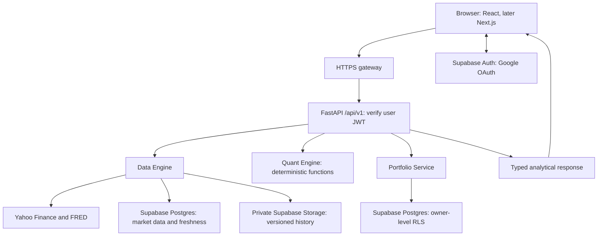

# Quant Stock — Investment Research Workspace

A private investment research dashboard with four workflows: Markets, Stock analysis,
Fundamentals and Portfolio. FastAPI coordinates financial data, deterministic analytics
and owner-private portfolio state. The independent `LPPLS/` project is preserved.

## Status and plan

The Supabase architecture plan from [PR #2](https://github.com/X8xpandax8X/Quant_dashboard/pull/2)
is now merged. **The Supabase migration itself has not been implemented.**
The current runnable application uses React/Vite, FastAPI and SQLite/local Parquet.
Use [requirement.txt](requirement.txt) as the single canonical specification and
[the plan report](docs/PLAN-REPORT.md) for implementation scope and acceptance gates.

| Area | Current baseline | Target in PR #2 |
|---|---|---|
| Web | React, TypeScript, Vite and Plotly | Preserve UI; migrate to Next.js after core-service parity |
| API | FastAPI `/api/v1`, direct store setup | Coordination of three separate domain services |
| Market persistence | SQLite cache index and local Parquet | Supabase Postgres metadata and private Storage artifacts |
| Portfolio persistence | Owner-filtered SQLite records | Supabase Postgres with database row-level security (RLS) |
| Identity | Demo cookie; Google OAuth proxy configuration | Supabase Auth with Google, verified JWTs and explicit team admission |
| Quantitative calculations | Pure Python/Pandas/NumPy functions | Preserve formulas; strengthen typed contracts and deterministic tests |
| Production AI | No required AI runtime | Future extension only; no agent framework in the current phase |

The implementation gate remains recorded in [progress](docs/progress.yaml).
The existing five-hour [continuation schedule](docs/CONTINUATION.md) checks status
and resumes authorized work after approval. Local checkout migration and CI remain pending.

## Target architecture — planned



### Domain responsibilities

- **Data Engine:** provider ingestion, normalization, validation, configurable freshness,
  refresh coordination and remote persistence. It does not enforce portfolio ownership.
- **Quant Engine:** financial mathematics from clean numeric inputs. It has no database,
  network, filesystem, authentication, HTTP or LLM dependency.
- **Portfolio Service:** owner-scoped state, target positions, holdings/transaction
  boundaries, revision conflicts and retry-safe writes.
- **FastAPI:** validates identity and requests, coordinates the services and returns
  versioned schemas. Existing dashboard API contracts are preserved during migration.

### Persistence and security decisions

Supabase Postgres becomes the canonical relational store; private Supabase Storage
holds large immutable history artifacts. Local disk may remain a disposable buffer
or demo/test adapter. Metadata publication follows verified object upload, with
checksums, refresh leases, stale fallback and recovery for partial failures.

Portfolio database operations carry the validated user's JWT so RLS enforces ownership,
including direct Data API access. Service-role credentials cannot be the normal
portfolio request path. Preserve Google email admission, protected active membership,
private cache clearing, draft recovery and appropriate CSRF/origin checks. Secrets
remain server-side and outside Git.

Simulation target weights remain integer basis points, separate from quantities,
cost basis and transaction records. Saved drafts may have incomplete totals; simulation
requires exactly 10,000 basis points. Existing weights do not imply historical trades.

See [architecture](docs/architecture.md), [data model](docs/data-model.md) and
[security](docs/security.md) for the detailed proposed contracts.

## Implementation sequence

| Phase | Priority |
|---|---|
| A — Audit and contracts | Verify checkout, preserve working modules, inventory identity/data migration |
| B — Supabase foundation | Development setup, Auth/admission, schemas, grants, RLS and private Storage |
| C — Data Engine | Remote repositories, freshness lifecycle, refresh leases and provider-failure tests |
| D — Quant Engine | Explicit input/output types, known numerical fixtures and no I/O coupling |
| E — Portfolio Service | Owner-private CRUD, targets/holdings/transactions, atomic revisions and idempotency |
| F — API integration | Coordinate all domains, minimum frontend auth adaptation, contracts and automated CI |
| G — AI placeholder | Documentation/interfaces only; no production agent runtime |

Next.js migration, remaining responsive/accessibility work and the independent
integrated audit follow core-service parity. All four dashboards remain in scope.
A future single AI Analyst may consume validated results; News, Risk and Fundamental
agents, a supervisor and orchestration frameworks require later evidence and review.
Core dashboards must work without LLM credentials or services.

## Project layout and migration map

| Existing path | Planned destination | Purpose |
|---|---|---|
| `app/` | `apps/api/` | FastAPI coordination, authentication and API schemas |
| `data_engine/` | `packages/data_engine/` | Providers, repositories, storage, schemas and freshness services |
| `quant_engine/` | `packages/quant_engine/` | Pure returns, risk, portfolio, CAPM, volume-profile and statistical functions |
| Portfolio logic in `app/db.py` | `packages/portfolio_service/` | Owner-scoped repositories, services, schemas and permissions |
| `frontend/` | `apps/web/` | Preserve React components, design tokens, charts and tests |
| Current schema setup | `supabase/migrations/` | One CLI-generated executable migration history |
| Persistence notes/fixtures | `database/policies/`, `database/seeds/` | Policy specifications and synthetic data; no duplicate migration history |
| `tests/`, `docs/`, `scripts/` | Same logical roles | Update imports and commands as modules move |
| `LPPLS/` | `LPPLS/` | Independent source and regression suite, unchanged |

These target directories are planned, not claims of completed scaffolding.
Repository: [X8xpandax8X/Quant_dashboard](https://github.com/X8xpandax8X/Quant_dashboard).
Current local folder: `/Users/pandamac/Desktop/Quant_stock`.
Planned canonical checkout: `/Users/pandamac/Documents/GitHub/Quant_stock`, pending
verification and migration. See [migration inventory](docs/migration.md).

## Run the current local demo

Use Python 3.12 and Node.js 22.12+ or 24. The local demo is network independent after dependency installation and keeps its database separate from production.

```sh
python3.12 -m venv .venv
.venv/bin/python -m pip install -r requirements.lock.txt
cd frontend
npm ci
cd ..
.venv/bin/python scripts/dev.py
```

Open **http://127.0.0.1:5173** and choose the demo sign-in. Use this exact origin; CSRF checks intentionally reject other origins. The demo uses deterministic illustrative prices and statements, visibly labeled throughout. Its local demo identity is shared by browsers using this demo instance. It is not the private-team Google deployment.

Saved demo portfolios live in `.state/demo/portfolios.sqlite3`. Stop both development servers with Ctrl+C. Port 8000 serves FastAPI; Vite proxies `/api` from port 5173. To serve the production frontend bundle through FastAPI, run `npm run build` in `frontend/` and restart the API.

## Research workflows

| Dashboard | Features |
|---|---|
| Markets | Seven benchmarks, candlestick cards, 1D/5D/1M/1Y windows, VIX gauge |
| Stock analysis | Price and period return, distribution and calendar, approximate volume profile, peer comparison, correlation, CAPM/SML scenarios |
| Fundamentals | Ratios and risk metrics, quarterly revenue/EPS with available forward consensus, margins, income flow, statements, analyst recommendations and targets |
| Portfolio | Long-only S&P 500 weights, sector allocation, daily-rebalanced simulation, private create/open/rename/save/delete and revision-conflict recovery |

All rates in the API are decimal fractions. The interface formats them as percentages. Missing data remains unavailable, never invented. Calculations, source limits and extension boundaries are documented in [Data methods](docs/DATA-METHODS.md).

## Current baseline checks

```sh
.venv/bin/python -m pytest
.venv/bin/python scripts/check_design_tokens.py
.venv/bin/python scripts/export_openapi.py
cd frontend
npm run contracts
npm run typecheck
npm test
npm run build
```

Browser checks run with `npm run test:e2e` from `frontend/` against the local application. See the audit report for the exact completed checks and remaining deployment prerequisites.

Optional public-provider smoke check (makes Yahoo/FRED requests; it does not submit portfolios):

```sh
.venv/bin/python scripts/smoke_data.py --live
```

The real gateway regression test uses a locally installed Caddy binary and temporary loopback ports:

```sh
CADDY_BIN=/absolute/path/to/caddy .venv/bin/python -m pytest tests/test_gateway.py -q
```

Existing LPPLS checks remain independent. From `LPPLS/`, run `../.venv/bin/python -m pytest tests -q --import-mode=importlib -o pythonpath=. -o cache_dir=/tmp/quant-stock-lppls-pytest`. Its Plotly 5 test dependency is pinned in the lockfile; no LPPLS source changes are required.

## Baseline storage, configuration and deployment

The commands above run the existing application. It uses SQLite WAL for portfolios
and a separate SQLite/Parquet market cache, with in-process refresh deduplication and
labeled stale/partial fallback. These adapters have not been replaced by Supabase.

Root `.env.example` documents the current demo/research configuration. The existing
[deployment and recovery guide](docs/DEPLOYMENT.md) describes the legacy Google proxy,
local volumes and SQLite backup/restore. It is not a Supabase deployment runbook.
Supabase project selection, environment credentials, Google callback configuration,
RLS migrations, Storage setup and remote recovery tests belong to the planned foundation.
No Supabase resources or deployment are provisioned by this README update.

Shared live deployment remains a separate action gated on confirmed data-use rights.
Do not commit credentials, private portfolios, caches or generated dependencies.

## Verification and completion

The commands above validate the current baseline; prior results are recorded in the
[audit](docs/AUDIT.md) and [plan report](docs/PLAN-REPORT.md). They do not prove Supabase
readiness. Outstanding browser/accessibility verification and final independent review
remain visible in [progress](docs/progress.yaml).

The migration requires real Supabase/Postgres isolation tests for two users,
unauthenticated and unadmitted callers, including direct Data API attempts. Verify JWT
validation, owner/parent constraints, concurrent revisions, rollback/idempotency,
Storage failures, refresh publication, identity mapping and recovery without developer
disk. Preserve numerical fixtures, generated API contracts and all dashboard flows.
No check is considered passed solely because this architecture is documented.

## Project documentation

- [Requirements](requirement.txt), [plan report](docs/PLAN-REPORT.md) and [roadmap](docs/roadmap.md).
- [Architecture](docs/architecture.md), [data model](docs/data-model.md) and [security](docs/security.md).
- [Migration](docs/migration.md), [progress](docs/progress.yaml) and [continuation schedule](docs/CONTINUATION.md).
- [Future AI scope](docs/future-agent-runtime.md): explicitly deferred production extensions.
- [AGENTS.md](AGENTS.md): development ownership and execution rules.
- [DESIGN.md](DESIGN.md), [UX-CONTRACT.md](UX-CONTRACT.md) and [design concepts](docs/concepts/README.md).
- [API contract](docs/API-CONTRACT.md) and [OpenAPI schema](docs/openapi.json): current versioned interfaces.
- [Data methods](docs/DATA-METHODS.md): calculation conventions, provider limits and missing-data behavior.
- [Independent audit](docs/AUDIT.md): observed evidence and unresolved verification.
