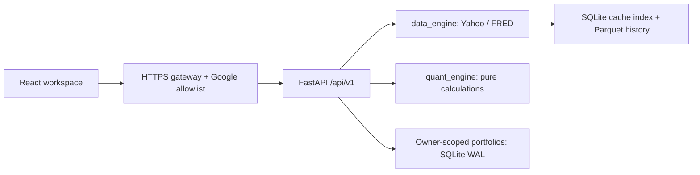

# Quant Stock — Investment Research Workspace

React + FastAPI investment research application based on `requirement.txt`. The existing `LPPLS/` application is independent and must remain unchanged.

## Requirements revision and review checkpoint — 2026-09-16

The canonical specification is [requirement.txt](requirement.txt). Read the
[revised plan report](docs/PLAN-REPORT.md) before continuing implementation.
The selected private repository is [X8xpandax8X/Quant_dashboard](https://github.com/X8xpandax8X/Quant_dashboard).
The current React/Vite application below is an in-progress baseline. The proposed
Next.js monorepo migration has **not** been implemented. New application changes remain paused for plan review. The existing five-hour
continuation schedule is active for status checks and resumes implementation once
that plan is approved; see [Continuation schedule](docs/CONTINUATION.md).
The baseline and revised documents are uploaded in [draft PR #1](https://github.com/X8xpandax8X/Quant_dashboard/pull/1).
PR #1 is now merged; local migration and CI remain pending.

- [Target architecture](docs/architecture.md)
- [Roadmap and acceptance gates](docs/roadmap.md)
- [Migration inventory and path mapping](docs/migration.md)
- [Actual progress](docs/progress.yaml)
- [Deferred production agents](docs/future-agent-runtime.md)

## Current architecture



## Project layout

- `app/`: typed API, authentication, portfolio persistence, and application entry point.
- `data_engine/`: providers, instrument registry, deterministic demo data, and persistent cache.
- `quant_engine/`: independently tested financial calculations and extension interfaces.
- `frontend/`: React, TypeScript, Vite, shared components and Plotly charts.
- `tests/`: API, authorization and integration tests. Engine tests live with their engines.
- `deploy/`: single-host Google-gated deployment configuration.
- `scripts/`: startup, contracts and backup/restore utilities.
- `docs/`: data methods, design concepts and verification evidence.

## Run locally

Use Python 3.12 and Node.js 22.12+ or 24. The local demo is network independent after dependency installation and keeps its database separate from production.

```sh
python3.12 -m venv .venv
.venv/bin/python -m pip install -r requirements.lock.txt
cd frontend
npm ci
cd ..
.venv/bin/python scripts/dev.py
```

Open **http://127.0.0.1:5173** and choose the demo sign-in. Use this exact origin; CSRF checks intentionally reject other origins. The demo uses deterministic illustrative prices and statements, visibly labeled throughout. Its local demo identity is shared by browsers using this demo instance. It is not the private-team Google deployment.

Saved demo portfolios live in `.state/demo/portfolios.sqlite3`. Stop both development servers with Ctrl+C. Port 8000 serves FastAPI; Vite proxies `/api` from port 5173. To serve the production frontend bundle through FastAPI, run `npm run build` in `frontend/` and restart the API.

## Research workflows

| Dashboard | Features |
|---|---|
| Markets | Seven benchmarks, candlestick cards, 1D/5D/1M/1Y windows, VIX gauge |
| Stock analysis | Price and period return, distribution and calendar, approximate volume profile, peer comparison, correlation, CAPM/SML scenarios |
| Fundamentals | Ratios and risk metrics, quarterly revenue/EPS with available forward consensus, margins, income flow, statements, analyst recommendations and targets |
| Portfolio | Long-only S&P 500 weights, sector allocation, daily-rebalanced simulation, private create/open/rename/save/delete and revision-conflict recovery |

All rates in the API are decimal fractions. The interface formats them as percentages. Missing data remains unavailable, never invented. Calculations, source limits and extension boundaries are documented in [Data methods](docs/DATA-METHODS.md).

## Checks

```sh
.venv/bin/python -m pytest
.venv/bin/python scripts/check_design_tokens.py
.venv/bin/python scripts/export_openapi.py
cd frontend
npm run contracts
npm run typecheck
npm test
npm run build
```

Browser checks run with `npm run test:e2e` from `frontend/` against the local application. See the audit report for the exact completed checks and remaining deployment prerequisites.

Optional public-provider smoke check (makes Yahoo/FRED requests; it does not submit portfolios):

```sh
.venv/bin/python scripts/smoke_data.py --live
```

The real gateway regression test uses a locally installed Caddy binary and temporary loopback ports:

```sh
CADDY_BIN=/absolute/path/to/caddy .venv/bin/python -m pytest tests/test_gateway.py -q
```

Existing LPPLS checks remain independent. From `LPPLS/`, run `../.venv/bin/python -m pytest tests -q --import-mode=importlib -o pythonpath=. -o cache_dir=/tmp/quant-stock-lppls-pytest`. Its Plotly 5 test dependency is pinned in the lockfile; no LPPLS source changes are required.

## Storage and deployment

The API uses SQLite WAL for users and owner-scoped portfolios. Market data uses a separate SQLite cache index and atomic Parquet versions. Concurrent refreshes are deduplicated within the single application process. Provider failures retain the last valid observation with a stale/partial state. Fundamentals and the dated constituent list refresh daily; active intraday views poll every five minutes.

Google sign-in, explicit email allowlists, HTTPS, private upstream ports and the server-side proxy trust boundary are configured in [Deployment and recovery](docs/DEPLOYMENT.md). That guide also includes manual backup/restore and migrations. No public deployment has been performed. Shared live deployment remains gated on confirmed data-use rights and operator-supplied Google credentials/domain.

## Design and API contracts

- [DESIGN.md](DESIGN.md): palette, typography and layout decisions.
- [UX-CONTRACT.md](UX-CONTRACT.md): shared navigation, state, accessibility and persistence behavior.
- [API contract](docs/API-CONTRACT.md) and [OpenAPI schema](docs/openapi.json): versioned interfaces; frontend types are generated from the schema.
- [Design concepts](docs/concepts/README.md): accepted visual direction and factual corrections.
- [Independent audit](docs/AUDIT.md): observed verification evidence and findings.
