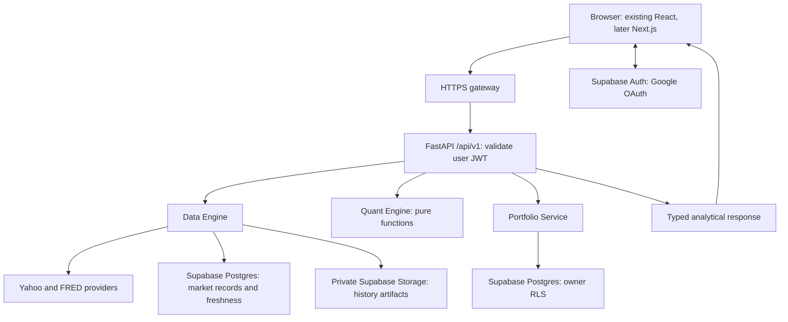

# Target architecture — Supabase core services

Status: **approved; opt-in core foundation implemented locally**, 2026-09-16. The running
baseline remains React/Vite + FastAPI with SQLite/local Parquet and proxy authentication.
This document describes the full target. See SUPABASE-DEVELOPMENT.md for the implemented subset and outstanding integration gates.

## Immediate priority and boundaries

Implement Data Engine, deterministic Quant Engine, owner-scoped Portfolio Service,
FastAPI integration, Supabase Postgres/Storage/Auth, and automated validation first.
Keep all four dashboard contracts and the independent LPPLS project. Next.js remains
the eventual frontend framework; its migration follows core-service parity. Limit
interim frontend changes to authentication and API compatibility. No production AI
agent, supervisor, LangGraph, CrewAI or Agents SDK is required in this phase.



There is no required path through an AI layer before the dashboard receives its
response. Future AI consumes a structured, authorized snapshot after core calculations.

## Domain contracts

| Domain | Owns | Must not do |
|---|---|---|
| Data Engine | Providers, normalization, validation, freshness, remote market persistence | Portfolio ownership, rendering or financial analytics |
| Quant Engine | Typed, deterministic numerical transformations | Database/filesystem/network calls, sessions, HTTP or authorization |
| Portfolio Service | Owner-scoped state, target weights, holdings/transaction records, concurrency | Provider downloads or financial-model implementation |
| FastAPI | JWT validation, input/response schemas and coordination | Absorb repositories, provider code or quant formulas |

Planned seams: `MarketRepository`, `HistoryObjectStore`, `RefreshCoordinator`,
`PortfolioRepository`, and a verified `Principal`. Names are design proposals;
implementation should retain compatible existing interfaces when practical. Dependencies
are injected. Repositories return internal models; API schemas and SQL rows stay separate.
`PortfolioRepository` receives the user's verified access context, not a privileged
service client. Quant functions receive clean frames, weights and scalar assumptions.

A stock analysis route loads market/benchmark/rate data through Data Engine, calls
Quant Engine and serializes metadata. Saved-portfolio analysis first loads a consistent
portfolio revision through Portfolio Service, then resolves symbols through Data Engine
and calculates in Quant Engine. The current transient simulation endpoint stays supported;
its inputs are validated but never treated as persisted ownership claims.

## Canonical remote persistence

Supabase Postgres owns relational market metadata, fundamentals, refresh state and
private portfolio data. Supabase Storage owns large immutable history artifacts.
Developer disks may hold disposable buffers or explicitly labeled offline fixtures;
production recovery must not depend on them. Storage paths are repository configuration,
not business-logic literals. Local SQLite remains only the pre-migration baseline or
a test/demo adapter, never a second production source of truth.

Freshness is a Data Engine concern. Request -> metadata/quality check -> reuse if
fresh -> claim bounded refresh lease if stale -> fetch -> normalize/validate -> upload
new immutable object -> transactionally publish its metadata pointer -> return.
Postgres and Storage do not share a transaction: upload failure leaves the old pointer;
DB failure leaves an unreferenced object for delayed cleanup. Readers pin a version,
verify checksum/schema, and never combine new metadata with old bytes. Retain a previous
valid version and use grace periods so cleanup cannot remove an active reader's object.

Use a per-key database lease with expiry/fencing and compare-and-swap publication,
not just an in-process lock. Record attempts/errors separately from last successful
retrieval; bounded backoff/negative caching avoids provider storms. On failure return
last valid data marked stale/partial with original observation times, or unavailable.
A refreshed cache cannot turn missing provider values into zeros.

| Data category | Proposed initial configurable policy |
|---|---|
| Active 1D/5D bars and indexes | Five minutes; provider/exchange session aware; preserve 5m/30m requested resolution |
| Daily OHLCV | Refresh after the instrument's market close or if stale/missing; avoid repeated closed-session fetches |
| FRED DGS10 | Daily, preserving provider observation date and non-publication days |
| Fundamentals | Daily stale check initially, plus refresh when a new reporting period is detected |
| Company metadata | Weekly default, configurable to monthly |
| S&P 500 constituents | Daily stale check initially, dated snapshots and last-valid fallback |

These policies are centrally configured and tested with an injected clock/calendar.
Browser polling may pause when hidden; it does not define backend freshness rules.

## Identity and owner isolation

Supabase Auth with Google becomes the identity authority. FastAPI validates the user
JWT and supplies that same user context to the Supabase Data API for portfolio requests.
RLS is the final owner boundary, including direct Data API attempts. Normal user routes
must never use a service-role/secret credential or a database role that bypasses RLS.
The private-team allowlist remains a requirement; authenticated does not mean admitted.
See [security.md](security.md) for membership, grants, JWT and policy design.

The gateway provides HTTPS/routing and may add defense in depth, but legacy identity
headers do not substitute for JWT verification. Retire OAuth2 Proxy only after Supabase
auth parity checks; do not deploy both as conflicting identity authorities.

## Planned layout

```text
apps/web/                          existing UI, eventual Next.js migration
apps/api/                          FastAPI and application coordination
packages/data_engine/              providers, repositories, storage, schemas, services
packages/quant_engine/             returns, risk, portfolio, CAPM, volume profile, statistics
packages/portfolio_service/        repositories, services, schemas, permissions
packages/agents/README.md          future design only
supabase/                         CLI configuration and generated migration history
  migrations/                     sole executable schema/policy migration history
 database/                        logical data-model documentation (no duplicate migration history)
  policies/                       policy specifications and validation cases
  seeds/                          synthetic test fixtures
 tests/                           data_engine, quant_engine, portfolio_service, API tests
 docs/                            architecture, data-model, security, roadmap and progress
```

Use Supabase CLI's actual migration layout discovered through `--help`; generate
migration files through the CLI rather than inventing filenames. The pasted
`database/migrations/` path is a conceptual grouping; keep only one executable history.
Do not reorganize working functions purely to populate directories.

## Delivery scope and references

Pin compatible dependencies during implementation. No Supabase project, bucket,
policy, migration, secret, account or paid service was created by this planning update.
No connected Supabase project tools were available in this session; this does not
block planning. Project selection, region/environment and credentials remain deployment
inputs for Phase B, not invented values.

Reviewed [Supabase changelog](https://supabase.com/changelog): explicit Data API grants
must be validated for new tables; do not assume automatic exposure. Retain Node 22+
compatibility and verify selected versions when implementing. Follow [Data API security](https://supabase.com/docs/guides/api/securing-your-api).
