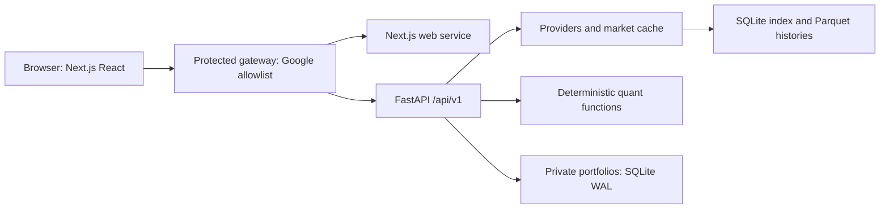

# Architecture: current baseline and proposed target

## Development, runtime and future scope

Astral development roles write and review code. They do not become production agents.
The target application uses Next.js/React TypeScript and FastAPI. Existing deterministic
Python calculations remain authoritative. No agent supervisor, Agents SDK, LangGraph,
model router or mandatory LLM call belongs to the MVP.



This is the **target** service topology. The current baseline is React/Vite with
FastAPI able to serve its built frontend. Framework versions/actions will be checked
and locked at implementation time. The current Python requirement is 3.12+; do not
lower it based on the older source's minimum.

## Proposed structure and migration boundaries

```text
Quant_stock/
  requirement.txt                  single authoritative specification
  apps/web/                        Next.js, React UI and browser tests
  apps/api/                        FastAPI, auth, API and portfolio services
  packages/data/                   providers, normalization and cache
  packages/quant/                  pure deterministic calculations
  packages/agents/README.md        deferred design only
  database/                        migrations, schema and lifecycle docs
  tests/                           shared integration/contract fixtures
  docs/                            architecture, methods, progress, audits
  .github/workflows/ci.yml          validation only
  docker-compose.yml               runnable web/API/gateway, persistent volumes
  README.md, AGENTS.md, DESIGN.md, UX-CONTRACT.md
  LPPLS/                           preserved independent project
```

The directories above are a proposed migration map; they have not been scaffolded
as fake working modules. Documentation structure is established in this checkpoint.
See migration.md for exact existing paths. Use package roots with explicit Python
imports; physical folder names do not require renaming established import namespaces.

## Contracts and storage

FastAPI owns versioned OpenAPI, with generated TypeScript types consumed by the web
app. Keep response metadata, nullable values, sample counts and quality explanations.
The browser owns controls/query state; Plotly owns marks, loaded only on the client.
Avoid server-rendering browser APIs, duplicate query providers and cross-user caches.
Preserve URL context but never put holdings/weights in URLs.

The protected gateway verifies Google sign-in/allowlisting; FastAPI validates proxy
trust and derives identity server-side. Portfolio writes enforce owner, CSRF/origin,
revision and idempotency constraints. Keep app state in SQLite WAL and the separate
market cache in SQLite/Parquet. PostgreSQL is not currently justified. Backups,
versioned migrations and single-host persistence remain mandatory.

An optional later explanation adapter must be server-side, feature-gated, consume
validated numbers, validate outputs, and fail without disabling research. Start with
zero endpoints. Never infer an API model ID or price from a development worker route.
